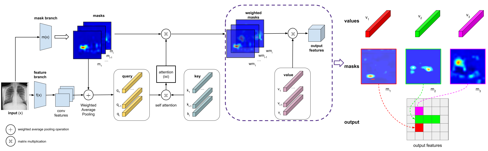
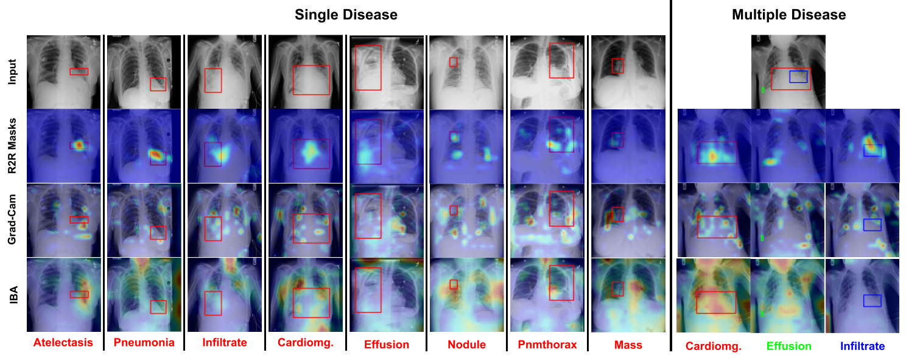

# Explainable Transformer Prototypes For Medical Diagnoses

[Ugur Demir](https://scholar.google.com/citations?user=Lzxk0PMAAAAJ&hl=en),
[Debesh Jha](https://scholar.google.com/citations?user=mMTyE68AAAAJ&hl=en),
[Zheyuan Zhang](https://scholar.google.com/citations?user=lHtpCNcAAAAJ&hl=en),
Elif Keles, Bradley Allen, Aggelos K. Katsaggelos,
[Ulas Bagci](https://bagcilab.com/)

<!---[](https://arxiv.org/) -->

## Overview

### Abstract
Deployments of artificial intelligence in medical diagnostics mandate not just accuracy and efficacy but also trust, emphasizing the need for explainability in machine decisions. The recent trend in automated medical image diagnostics leans towards the deployment of Transformer-based architectures, credited to their impressive capabilities. Since the self-attention feature of transformers contributes towards identifying crucial regions during the classification process, they enhance the trustability of the methods. However, the complex intricacies of these attention mechanisms may fall short of effectively pinpointing the regions of interest directly influencing AI decisions. Our research endeavors to innovate a unique attention block that underscores the correlation between 'regions' rather than 'pixels'. To address this challenge, we introduce an innovative system grounded in prototype learning, featuring an advanced self-attention mechanism that goes beyond conventional ad-hoc visual explanation techniques by offering comprehensible visual insights. A combined quantitative and qualitative methodological approach was used to demonstrate the effectiveness of the proposed method on the large-scale NIH chest X-ray dataset. Experimental results showed that our proposed method offers a promising direction for explainability, which can lead to the development of more trustable systems, which can facilitate easier and rapid adoption of such technology into routine clinics.


## Architecture
<p align="center">
  
</p>

## Results

### Lung CT
We used public NIH chest X-ray dataset. It consists of 112,120 frontal-view X-ray images having 14 different types of disease labels obtained from 30,805 unique patients.

<p align="center">
  
</p>


## Usage
Update the CUDA_VERSION variable in requirements.sh file. Run the following line.
```
./requirements.sh
```

Example visualization code;
```
python main.py -a iba --conf covid1 --layer layer2 --scale_size 512 --norm 01 -t 1 --inp <img_dir>/study_0953.nii.gz
```


